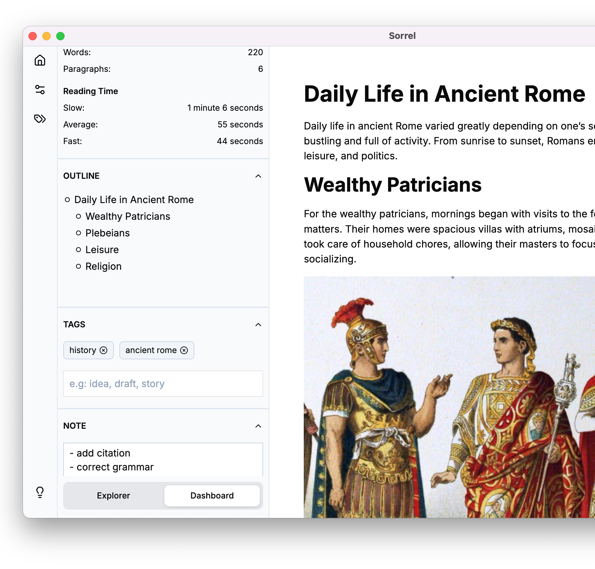

import { Card, CardGrid, LinkButton } from '@astrojs/starlight/components';

<CardGrid>
  <Card>
    ##### Your Writing, Organized

		A desktop application designed for writers of all kinds. Whether you're a novelist, blogger, student, or professional, Sorrel provides the tools you need to stay organized, focused, and productive.

		##### Simple Thoughts. Seamless Flow.
		A clean, minimalist interface helps you focus on what matters most: your words.
  </Card>
  <Card>
		
  </Card>
</CardGrid>

### Your Creative Companion
Sorrel empowers your writing process with a suite of essential tools:

<CardGrid>
	<Card title="Organized and Focused Workflow">
		Seamlessly manage multiple workspaces, outline long-form content with ease, and drown out distractions with a dedicated **Focus Mode**.
	</Card>
	<Card title="Instant Access to Your Ideas">
		Quickly find what you need with an intuitive tagging system for keywords and materials, complemented by a powerful search function for specific notes.
	</Card>
	<Card title="Markdown Support">
		Utilize Markdown syntax support to format your writing effortlessly, allowing you to focus on creativity without getting bogged down intechnicalities.
	</Card>
	<Card title="Export Made Easy">
		Share your work in a variety of formats including **DOCX**, **PDF**, **HTML**, and **Markdown**, offering ultimate flexibility for your publishing needs.
	</Card>
</CardGrid>

	### Take Sorrel for a spin — it’s on us.
	<LinkButton href="/download">Get Sorrel Now</LinkButton>

